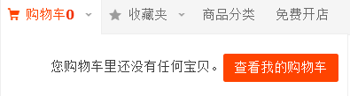
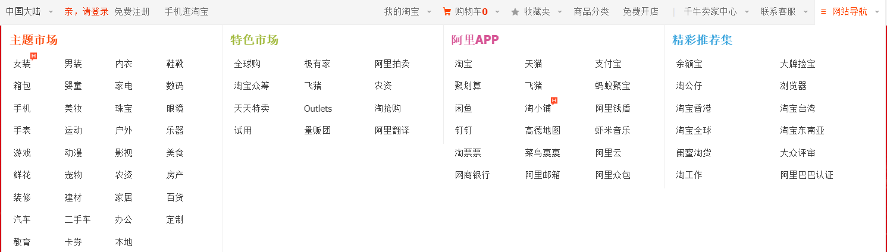
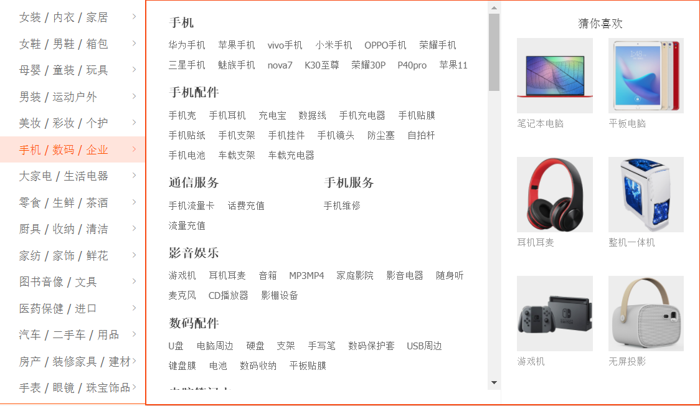
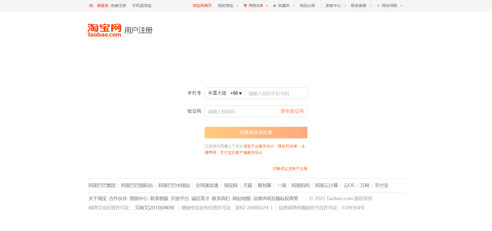
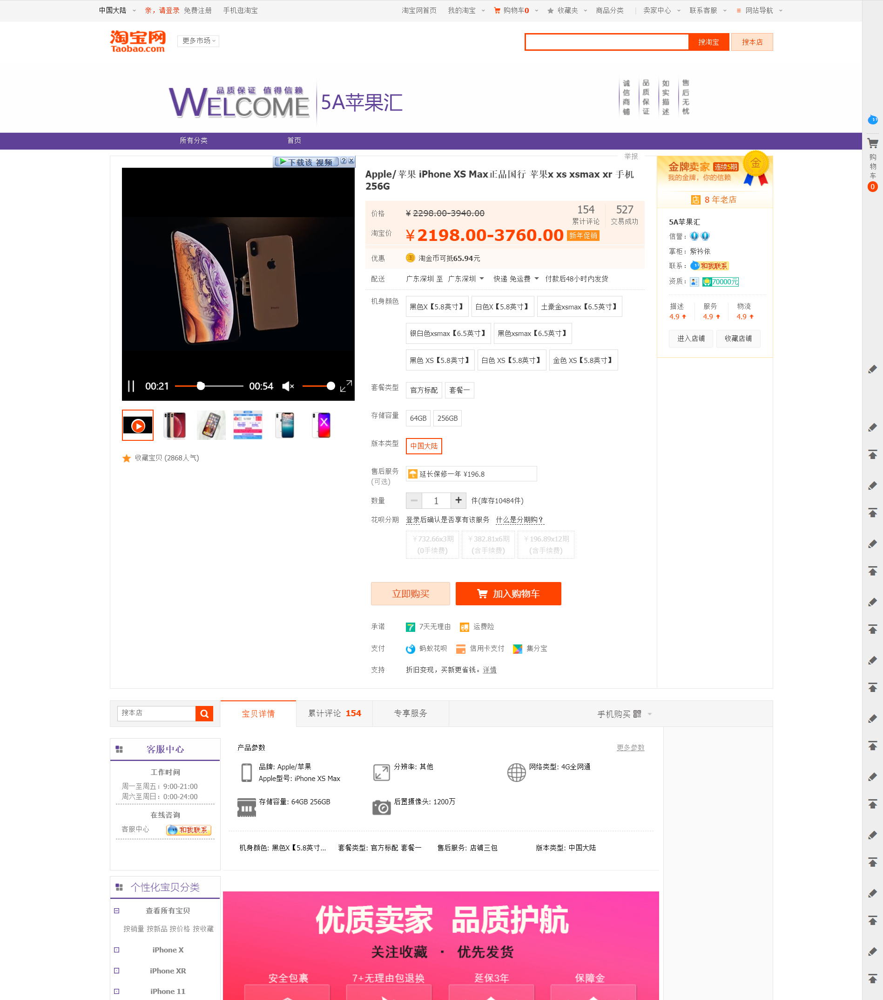
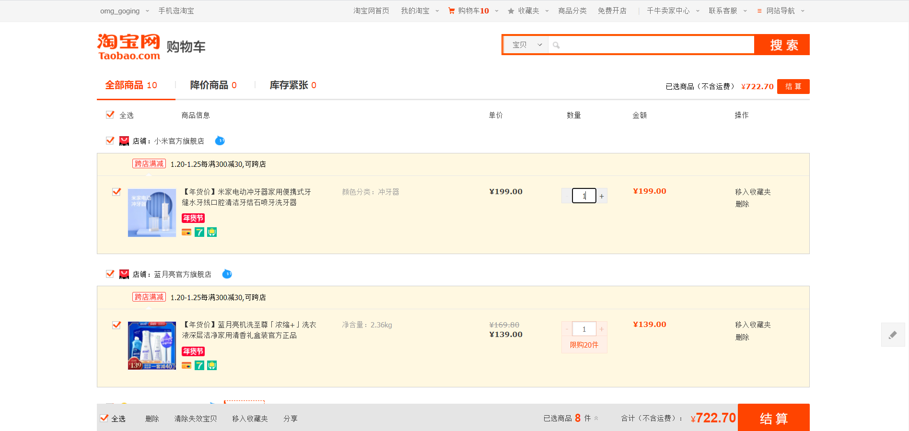

# 阶段项目-仿淘宝电商网站开发

## 一、项目说明

本项目旨在打造一个仿淘宝的电商网站，参考网址：www.taobao.com

初步计划共分为六大模块：

- 首页
- 登录页
- 注册页
- 商品列表页
- 商品详情页
- 购物车结算页

本项目github地址：https://github.com/githubxiaoyuan/taobao


**项目技术选型：**

开发模式：前后端分离

前端：HTML、CSS、H5C3、Javascript、jquery、layui

后端：基于NodeJs，express、mysql、cors、jwt等模块

项目管理：git、gulp4


**项目启动说明：**

1、从github上克隆项目到本地：`git clone https://github.com/githubxiaoyuan/taobao.git`

2、安装NodeJs（已安装忽略）：https://nodejs.org/zh-cn/

3、安装Mysql（已安装忽略）：https://dev.mysql.com/downloads/installer/

4、将项目db目录中的`taobao.sql`文件导入到mysql数据库中

5、开启mysql服务，打开终端，进入到项目的Server文件夹，输入`node main.js` 命令启动项目的服务端（如遇报错，可先执行`npm install`命令）

6、在浏览器地址栏输入：`http://127.0.0.1` 即可访问web（因可能存在兼容性问题，推荐使用谷歌浏览器打开）


**注意：mysql配置文件账号默认为root，密码默认为空，如需更改请打开Server文件夹下的mysql.json文件进行修改**


### 1.1 首页

**预计样式：**


**主要实现功能：**

- 头部区域下拉菜单、购物车提示

  

  

- 搜索商品功能

- 左侧商品分类二级面板

  

- 中间2个轮播图

- 右侧用户信息模块、便捷功能导航

- 窗口固定右侧的电梯导航

- 从服务端渲染推荐商品

  

  


### 1.2 登录页

样式：


功能说明：通过数据库验证，实现用户登录功能

方案一：

​	通过手机号短信验证进行登录

方案二：

​	通过传统账号密码形式进行登录


### 1.3 注册页

样式：



功能说明：实现用户注册功能，注册成功后添加到数据库用户表中，并保证唯一性，后续不能再注册相同账号

方案一：

​	通过手机号进行注册

方案二：

​	通过传统的用户名、邮箱、密码等形式进行注册，用户名格式为6-16位，可以为中文、数字、字母组合，具备唯一性；密码格式为8-16位，必须同时包含字母、数字，可以包含特殊符号；邮箱作为修改密码和找回密码的依据，具备唯一性。


### 1.4 商品列表页

样式：


功能说明：展现商品分类下的商品，并进行分页显示，可以通过各种条件进行筛选、排序等


### 1.5 商品详情页

样式：



功能说明：显示商品的具体信息、商品图片放大镜功能，购买商品、加入购物车功能（必须先进行登录）


### 1.6 购物车结算页

样式：



功能说明：显示用户添加到购物车中的商品，实现全选商品、删除选中商品、增减商品数量、计算商品金额、计算选中商品总价、购物车结算等功能。


## 二、项目API接口文档

### 说明

1、项目的请求根路径为：` http://127.0.0.1`

2、以`/api`开头的请求路径，不需要访问权限

3、以`/shop、/user`开头的请求路径，需要在请求头中携带`Authorization`身份认证字段，才能正常访问成功


### 登录注册

#### 用户注册

**简要描述：**

- 用户注册接口

**请求URL：**

- `/api/registered`

**请求方式：**

- POST

**请求体：**

| 参数名   | 必选 | 类型   | 说明   |
| -------- | ---- | ------ | ------ |
| username | 是   | string | 用户名 |
| email    | 是   | string | 邮箱   |
| password | 是   | string | 密码   |

**返回示例：**

```json
{
    status：1,
    message："注册成功！"
}
```

**返回参数说明：**

| 参数名  | 类型   | 说明                      |
| ------- | ------ | ------------------------- |
| status  | int    | 表示请求是否成功，1：成功 |
| message | string | 请求结果的描述信息        |

**状态码说明：**

| status | message                        |
| ------ | ------------------------------ |
| 0      | 数据库连接错误                 |
| **1**  | **注册成功！**                 |
| 2      | 查询数据库失败！               |
| 3      | 用户名已存在！                 |
| 4      | 用户注册失败，请求数据库出错！ |
| 5      | 邮箱已被注册！                 |


#### 用户登录

**简要描述：**

- 用户登录接口

**请求URL：**

- `/api/login`

**请求方式：**

- POST

**请求体：**

| 参数名   | 必选 | 类型   | 说明   |
| -------- | ---- | ------ | ------ |
| username | 是   | string | 用户名 |
| password | 是   | string | 密码   |

**返回示例：**

```json
{
    status：1,
    message："登陆成功！"
}
```

**返回参数说明：**

| 参数名  | 类型   | 说明                      |
| ------- | ------ | ------------------------- |
| status  | int    | 表示请求是否成功，1：成功 |
| message | string | 请求结果的描述信息        |

**状态码说明：**

| status | message                        |
| ------ | ------------------------------ |
| 0      | 数据库连接错误                 |
| **1**  | **登陆成功！**                 |
| 2      | 用户不存在，请重新输入！       |
| 3      | 用户名或密码错误，请重新输入！ |
| 4      | 数据库查询失败！               |


### 商品列表

#### 获取商品列表信息

**简要描述：**

- 获取商品列表信息接口

**请求URL：**

- `/api/goodslist`

**请求方式：**

- GET

**参数：**

- 无

**返回示例：**

```js
{
    status：1,
    message："商品列表数据获取成功",
    total:1000,
    limit:48,
    data:[
    	{
            id:1,
            category:'手机',
            goods_title:'苹果12',
            goods_price:3000,
            goods_sales:566,
            goods_img:'http://...',
            shop_name:'瑞克数码',
            seller:'卖家'
        },
        ...
    ]
}
```

**返回参数说明：**

| 参数名  | 类型   | 说明                      |
| ------- | ------ | ------------------------- |
| status  | int    | 表示请求是否成功，1：成功 |
| message | string | 请求结果的描述信息        |
| total   | int    | 商品总数目                |
| limit   | int    | 每页显示的商品数目        |
| data    | array  | 返回的商品列表数据        |

**状态码说明：**

| status | message                  |
| ------ | ------------------------ |
| 0      | 数据库连接错误           |
| **1**  | **商品列表数据获取成功** |
| 2      | 数据库请求错误           |


#### 根据销量进行商品排序

**简要描述：**

- 销量排序接口

**请求URL：**

- `/api/goodslist/sales`

**请求方式：**

- GET

**参数：**

- 无

**返回示例：**

```js
{
    status：1,
    message："商品列表数据获取成功",
    total:1000,
    limit:48,
    data:[
    	{
            id:1,
            category:'手机',
            goods_title:'苹果12',
            goods_price:3000,
            goods_sales:566,
            goods_img:'http://...',
            shop_name:'瑞克数码',
            seller:'卖家'
        },
        ...
    ]
}
```

**返回参数说明：**

| 参数名  | 类型   | 说明                      |
| ------- | ------ | ------------------------- |
| status  | int    | 表示请求是否成功，1：成功 |
| message | string | 请求结果的描述信息        |
| total   | int    | 商品总数目                |
| limit   | int    | 每页显示的商品数目        |
| data    | array  | 返回的商品列表数据        |

**状态码说明：**

| status | message                  |
| ------ | ------------------------ |
| 0      | 数据库连接错误           |
| **1**  | **商品列表数据获取成功** |
| 2      | 数据库请求错误           |


#### 根据信用进行商品排序

**简要描述：**

- 信用排序接口

**请求URL：**

- `/api/goodslist/credit`

**请求方式：**

- GET

**参数：**

- 无

**返回示例：**

```js
{
    status：1,
    message："商品列表数据获取成功",
    total:1000,
    limit:48,
    data:[
    	{
            id:1,
            category:'手机',
            goods_title:'苹果12',
            goods_price:3000,
            goods_sales:566,
            goods_img:'http://...',
            shop_name:'瑞克数码',
            seller:'卖家'
        },
        ...
    ]
}
```

**返回参数说明：**

| 参数名  | 类型   | 说明                      |
| ------- | ------ | ------------------------- |
| status  | int    | 表示请求是否成功，1：成功 |
| message | string | 请求结果的描述信息        |
| total   | int    | 商品总数目                |
| limit   | int    | 每页显示的商品数目        |
| data    | array  | 返回的商品列表数据        |

**状态码说明：**

| status | message                  |
| ------ | ------------------------ |
| 0      | 数据库连接错误           |
| **1**  | **商品列表数据获取成功** |
| 2      | 数据库请求错误           |


#### 根据价格从低到高进行商品排序

**简要描述：**

- 价格从低到高排序接口

**请求URL：**

- `/api/goodslist/price_asc`

**请求方式：**

- GET

**参数：**

- 无

**返回示例：**

```js
{
    status：1,
    message："商品列表数据获取成功",
    total:1000,
    limit:48,
    data:[
    	{
            id:1,
            category:'手机',
            goods_title:'苹果12',
            goods_price:3000,
            goods_sales:566,
            goods_img:'http://...',
            shop_name:'瑞克数码',
            seller:'卖家'
        },
        ...
    ]
}
```

**返回参数说明：**

| 参数名  | 类型   | 说明                      |
| ------- | ------ | ------------------------- |
| status  | int    | 表示请求是否成功，1：成功 |
| message | string | 请求结果的描述信息        |
| total   | int    | 商品总数目                |
| limit   | int    | 每页显示的商品数目        |
| data    | array  | 返回的商品列表数据        |

**状态码说明：**

| status | message                  |
| ------ | ------------------------ |
| 0      | 数据库连接错误           |
| **1**  | **商品列表数据获取成功** |
| 2      | 数据库请求错误           |


#### 根据价格从高到低进行商品排序

**简要描述：**

- 价格从高到低排序接口

**请求URL：**

- `/api/goodslist/price_desc`

**请求方式：**

- GET

**参数：**

- 无

**返回示例：**

```js
{
    status：1,
    message："商品列表数据获取成功",
    total:1000,
    limit:48,
    data:[
    	{
            id:1,
            category:'手机',
            goods_title:'苹果12',
            goods_price:3000,
            goods_sales:566,
            goods_img:'http://...',
            shop_name:'瑞克数码',
            seller:'卖家'
        },
        ...
    ]
}
```

**返回参数说明：**

| 参数名  | 类型   | 说明                      |
| ------- | ------ | ------------------------- |
| status  | int    | 表示请求是否成功，1：成功 |
| message | string | 请求结果的描述信息        |
| total   | int    | 商品总数目                |
| limit   | int    | 每页显示的商品数目        |
| data    | array  | 返回的商品列表数据        |

**状态码说明：**

| status | message                  |
| ------ | ------------------------ |
| 0      | 数据库连接错误           |
| **1**  | **商品列表数据获取成功** |
| 2      | 数据库请求错误           |


#### 根据输入的价格区间进行商品排序

**简要描述：**

- 价格区间排序接口

**请求URL：**

- `/api/goodslist/price_range`

**请求方式：**

- GET

**参数：**

| 参数名 | 必选 | 类型  | 说明       |
| ------ | ---- | ----- | ---------- |
| price1 | 是   | float | 第一个价格 |
| price2 | 是   | float | 第二个价格 |

**返回示例：**

```js
{
    status：1,
    message："商品列表数据获取成功",
    total:1000,
    limit:48,
    data:[
    	{
            id:1,
            category:'手机',
            goods_title:'苹果12',
            goods_price:3000,
            goods_sales:566,
            goods_img:'http://...',
            shop_name:'瑞克数码',
            seller:'卖家'
        },
        ...
    ]
}
```

**返回参数说明：**

| 参数名  | 类型   | 说明                      |
| ------- | ------ | ------------------------- |
| status  | int    | 表示请求是否成功，1：成功 |
| message | string | 请求结果的描述信息        |
| total   | int    | 商品总数目                |
| limit   | int    | 每页显示的商品数目        |
| data    | array  | 返回的商品列表数据        |

**状态码说明：**

| status | message                  |
| ------ | ------------------------ |
| 0      | 数据库连接错误           |
| **1**  | **商品列表数据获取成功** |
| 2      | 数据库请求错误           |


### 商品详情

#### 获取商品详情页数据

**简要描述：**

- 获取商品详情数据接口

**请求URL：**

- `/api/item`

**请求方式：**

- GET

**url携带参数：**

| 参数名 | 必选 | 类型 | 说明   |
| ------ | ---- | ---- | ------ |
| id     | 是   | int  | 商品ID |

**返回示例：**

```js
{
    status：1,
    message："获取商品详情数据成功",
    data:
    	{
            id:1,
            category:'手机',
            goods_title:'商品标题',
            goods_price:3000,
            goods_sales:566,
            cmt_num:200,
            goods_reserve:1000,
            goods_img:'http://...',
            shop_name:'瑞克数码',
            seller:'卖家',
            reputation:'...',
            qualify:'50000元',
            grade_desc:4.8,
            grade_service:4.8,
            grade_logistics:4.8,
            shop_years:10,
            gold_periods:2,
            goods_params:'...',
            goods_desc:'...'
        }
}
```

**返回参数说明：**

| 参数名  | 类型   | 说明                      |
| ------- | ------ | ------------------------- |
| status  | int    | 表示请求是否成功，1：成功 |
| message | string | 请求结果的描述信息        |
| data    | array  | 返回的商品详情数据        |

**状态码说明：**

| status | message                  |
| ------ | ------------------------ |
| 0      | 数据库连接错误           |
| **1**  | **获取商品详情数据成功** |
| 2      | 数据库请求错误           |
| 3      | 该商品不存在！           |


#### 获取商品库存数量

**简要描述：**

- 获取商品库存数量接口

**请求URL：**

- `/api/item/goods_num`

**请求方式：**

- GET

**url携带参数：**

| 参数名 | 必选 | 类型 | 说明   |
| ------ | ---- | ---- | ------ |
| id     | 是   | int  | 商品ID |

**返回示例：**

```js
{
    status：1,
    message："获取商品库存成功！",
    data:1433
}
```

**返回参数说明：**

| 参数名  | 类型   | 说明                      |
| ------- | ------ | ------------------------- |
| status  | int    | 表示请求是否成功，1：成功 |
| message | string | 请求结果的描述信息        |
| data    | int    | 返回的对应商品的库存      |

**状态码说明：**

| status | message                |
| ------ | ---------------------- |
| 0      | 数据库连接错误         |
| **1**  | **获取商品库存成功！** |
| 2      | 数据库请求错误         |
| 3      | 获取商品库存失败！     |


### 个人中心

#### 获取用户基本信息

**简要描述：**

- 获取用户信息接口

**请求URL：**

- `/user/userInfo`

**请求方式：**

- GET

**Header:**

```js
Authorization:Bearer + token
```

**参数：**

- 无

**返回示例：**

```js
{
    status：1,
    message："获取用户信息成功",
    data:'xiaoyuan'
}
```

**返回参数说明：**

| 参数名  | 类型   | 说明                      |
| ------- | ------ | ------------------------- |
| status  | int    | 表示请求是否成功，1：成功 |
| message | string | 请求结果的描述信息        |
| data    | string | 返回用户名                |

**状态码说明：**

| status | message              |
| ------ | -------------------- |
| **1**  | **获取用户信息成功** |


### 购物车

#### 添加商品到购物车

**简要描述：**

- 添加商品到购物车接口

**请求URL：**

- `/shop/addGoods`

**请求方式：**

- POST

**Header:**

```js
Authorization:Bearer + token
```

**请求体：**

| 参数     | 必选 | 类型 | 说明     |
| -------- | ---- | ---- | -------- |
| goodsId  | 是   | int  | 商品ID   |
| goodsNum | 是   | int  | 商品数量 |

**返回示例：**

```js
{
    status：1,
    message："添加商品到购物车成功！"
}
```

**返回参数说明：**

| 参数名  | 类型   | 说明                      |
| ------- | ------ | ------------------------- |
| status  | int    | 表示请求是否成功，1：成功 |
| message | string | 请求结果的描述信息        |

**状态码说明：**

| status | message                                                      |
| ------ | ------------------------------------------------------------ |
| 0      | 数据库连接错误                                               |
| **1**  | **添加商品到购物车成功！**                                   |
| 2      | 数据库请求发生错误                                           |
| 3      | 您当前所操作的账户不存在！                                   |
| 4      | 您要添加的商品已失效！                                       |
| 5      | 添加商品失败，请重新尝试！                                   |
| 6      | 添加后购物车中该商品数量大于库存总量，请减少数量后重新添加！ |


#### 购物车信息查询

**简要描述：**

- 获取购物车信息接口

**请求URL：**

- `/shop/cartInfo`

**请求方式：**

- POST

**Header:**

```js
Authorization:Bearer + token
```

**请求体：**

- 无

**返回示例：**

```js
{
    status：1,
    message："购物车状态请求成功！"
}
```

**返回参数说明：**

| 参数名  | 类型   | 说明                      |
| ------- | ------ | ------------------------- |
| status  | int    | 表示请求是否成功，1：成功 |
| message | string | 请求结果的描述信息        |

**状态码说明：**

| status | message                  |
| ------ | ------------------------ |
| 0      | 数据库连接错误           |
| **1**  | **购物车状态请求成功！** |
| 2      | 数据库请求发生错误       |


#### 更新用户购物车商品数量

**简要描述：**

- 更新购物车中商品数量接口

**请求URL：**

- `/shop/updateGoodsNum`

**请求方式：**

- POST

**Header:**

```js
Authorization:Bearer + token
```

**请求体：**

| 参数     | 必选 | 类型 | 说明     |
| -------- | ---- | ---- | -------- |
| goodsId  | 是   | int  | 商品ID   |
| goodsNum | 是   | int  | 商品数量 |

**返回示例：**

```js
{
    status：1,
    message："更新购物车商品数量成功！"
}
```

**返回参数说明：**

| 参数名  | 类型   | 说明                      |
| ------- | ------ | ------------------------- |
| status  | int    | 表示请求是否成功，1：成功 |
| message | string | 请求结果的描述信息        |

**状态码说明：**

| status | message                      |
| ------ | ---------------------------- |
| 0      | 数据库连接错误               |
| **1**  | **更新购物车商品数量成功！** |
| 2      | 数据库请求发生错误           |
| 3      | 您当前所操作的账户不存在！   |
| 4      | 更新数据失败，请重试！       |


#### 删除购物车商品

**简要描述：**

- 删除购物车中商品接口

**请求URL：**

- `/shop/deleteCartGoods`

**请求方式：**

- POST

**Header:**

```js
Authorization:Bearer + token
```

**请求体：**

| 参数    | 必选 | 类型 | 说明   |
| ------- | ---- | ---- | ------ |
| goodsId | 是   | int  | 商品ID |

**返回示例：**

```js
{
    status：1,
    message："删除购物车商品成功！"
}
```

**返回参数说明：**

| 参数名  | 类型   | 说明                      |
| ------- | ------ | ------------------------- |
| status  | int    | 表示请求是否成功，1：成功 |
| message | string | 请求结果的描述信息        |

**状态码说明：**

| status | message                            |
| ------ | ---------------------------------- |
| 0      | 数据库连接错误                     |
| **1**  | **删除购物车商品成功！**           |
| 2      | 数据库请求发生错误                 |
| 3      | 您当前所操作的账户不存在！         |
| 4      | 删除商品失败，请重试！             |
| 5      | 删除购物车商品失败，可能已被删除！ |


#### 购物车结算

**简要描述：**

- 购物车结算接口

**请求URL：**

- `/shop/settlement`

**请求方式：**

- POST

**Header:**

```js
Authorization:Bearer + token
```

**请求体：**

| 参数     | 必选 | 类型 | 说明     |
| -------- | ---- | ---- | -------- |
| goodsId  | 是   | int  | 商品ID   |
| goodsNum | 是   | int  | 商品数量 |

**返回示例：**

```js
{
    status：1,
    message："结算成功！"
}
```

**返回参数说明：**

| 参数名  | 类型   | 说明                      |
| ------- | ------ | ------------------------- |
| status  | int    | 表示请求是否成功，1：成功 |
| message | string | 请求结果的描述信息        |

**状态码说明：**

| status | message                    |
| ------ | -------------------------- |
| 0      | 数据库连接错误             |
| **1**  | **结算成功！**             |
| 2      | 数据库请求发生错误         |
| 3      | 您当前所操作的账户不存在！ |
| 4      | 结算该商品失败，库存不足！ |
| 5      | 结算该商品失败，原因未知！ |
| 6      | 结算商品失败，请重试！     |


#### 清空购物车

**简要描述：**

- 清空购物车接口

**请求URL：**

- `/shop/clearGoods`

**请求方式：**

- POST

**Header:**

```js
Authorization:Bearer + token
```

**请求体：**

- 无

**返回示例：**

```js
{
    status：1,
    message："清空购物车成功"
}
```

**返回参数说明：**

| 参数名  | 类型   | 说明                      |
| ------- | ------ | ------------------------- |
| status  | int    | 表示请求是否成功，1：成功 |
| message | string | 请求结果的描述信息        |

**状态码说明：**

| status | message                    |
| ------ | -------------------------- |
| 0      | 数据库连接错误             |
| **1**  | **清空购物车成功**         |
| 2      | 数据库请求发生错误         |
| 3      | 您当前所操作的账户不存在！ |
| 4      | 清空购物车失败，请重新尝试 |


## 三、项目开发进度


### 2021.2.24

- 对主页的商品展示进行了动态渲染
- 增加了登录后跳转到之前页面以及退出登录功能
- 增加了根据商品关键词进行搜索的功能
- 使用gulp对项目进行了打包压缩


### 2021.2.11

- 完成了购物车模块，至此，项目初步拟定的六大核心模块已全部完成，后续计划进行扩展和优化等


### 2021.2.8

- 实现了商品列表的初步筛选功能，可根据默认、销量、信用、价格高低、价格区间进行筛选
- 完成了商品详情页面的动态渲染，根据url传入的商品ID参数渲染对应的商品详情页面数据
- 完成了加入商品到购物车功能
- 完成了网站头部导航中的迷你购物车显示功能


### 2021.2.7

- 完成了登录后端模块，全站采用token认证机制进行身份认证


### 2021.2.4

- 完成了注册的后端API编写，并进行了前后端交互，注册模块完结。


### 2021.2.3

- 完成了商品详情页的初步制作


### 2021.1.31

- 完成了商品列表后端接口制作，实现了商品列表页的动态数据渲染


### 2021.1.30

- 重构了项目文件结构为前后端分离开发模式

- 完成了商品列表页的前端页面制作


### 2021.1.24

- 使用git初始化项目，并将项目推送到了github仓库中，https://github.com/githubxiaoyuan/taobao

- 完成了首页的前端页面制作
- 完成了登录的前端页面制作
- 完成了注册的前端页面制作